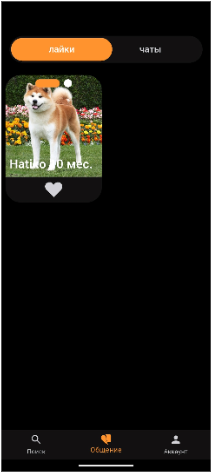
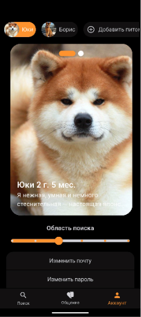

## Petsder

Petsder is a Flutter mobile application for discovering, listing, and interacting with pets. It integrates Firebase and Supabase, supports push notifications, geolocation, image picking, and a feature‑oriented UI.

## Features
- **Authentication**: Firebase Auth with Google Sign‑In
- **Backend**: Firebase (Core, Firestore, Messaging) and Supabase client
- **State management**: BLoC and Elementary
- **Navigation**: auto_route
- **Data modeling**: freezed, json_serializable
- **UI**: Feature‑first structure, SVG assets, typeahead, smooth page indicator
- **Device**: Geolocation, secure storage, image picker

## Technology Stack
- Flutter (Dart 3.5)
- Firebase: Core, Auth, Firestore, Messaging
- Supabase Flutter SDK
- Packages: `auto_route`, `bloc`/`flutter_bloc`, `elementary`, `freezed`, `json_serializable`, `flutter_svg`, `geolocator`, `flutter_secure_storage`, `image_picker`, `intl`, etc.

## Project Structure
```
lib/
  common/           # App-level widgets, DI, app bootstrapping, logging
  data/             # DTOs/converters/models for persistence
  domain/           # Business logic interfaces and use cases (per feature)
  ui/features/      # Feature-first UI screens and widgets
  ui/theme/         # Theming
  ui/widgets/       # Reusable UI components
  firebase_options.dart  # Generated by FlutterFire CLI
  main.dart         # App entry point (Firebase & Supabase init)
```

## Prerequisites
- Flutter SDK (stable) with Dart 3.5.x
- Android Studio (Android SDK/NDK, emulator) and/or Xcode (macOS for iOS)
- CocoaPods (for iOS): `sudo gem install cocoapods`
- Firebase project (if you plan to use your own)
- Supabase project (if you plan to use your own)

## Configuration

### Firebase
This repo already includes `firebase_options.dart` (generated) and `android/app/google-services.json`.

If you need to point to your own Firebase project:
1. Install FlutterFire CLI: `dart pub global activate flutterfire_cli`
2. Login and configure: `flutterfire configure`
3. Replace `android/app/google-services.json` and regenerate `lib/firebase_options.dart`.

### Supabase
The Supabase URL and anon key are initialized in `lib/main.dart`.

To use your own Supabase project, update the `Supabase.initialize` call in `main.dart`, or better, source them from environment/configuration for production builds.

## Setup
1. Clone the repo
2. Install dependencies:
   ```bash
   flutter pub get
   ```
3. Generate code (freezed/json/route builders where applicable):
   ```bash
   dart run build_runner build --delete-conflicting-outputs
   ```

## Usage
- Launch the app on a device or emulator: `flutter run`
- Sign in with Google when prompted
- Allow notifications and location permissions for full functionality
- Browse, search, and list pets (feature screens live under `lib/ui/features`)
- For development, re-generate models after changes: `dart run build_runner build -d`

## Running
```bash
flutter run
```

Select your target device in your IDE or pass `-d` to the command line.

## Build
- Android (release):
  ```bash
  flutter build apk --release
  # or App Bundle
  flutter build appbundle --release
  ```
- iOS (release, on macOS):
  ```bash
  cd ios && pod install && cd ..
  flutter build ios --release
  ```

## Testing
```bash
flutter test
```

## Notes
- Push notifications require platform‑specific setup (APNs for iOS, Firebase for Android). Ensure proper capability and certificate configuration.
- Location features require runtime permissions; verify permission flows on both platforms.
- Keep API keys and secrets out of source control for production. Use runtime configuration or build‑time env where possible.

## Screenshots

 
  

  

 
 
  


